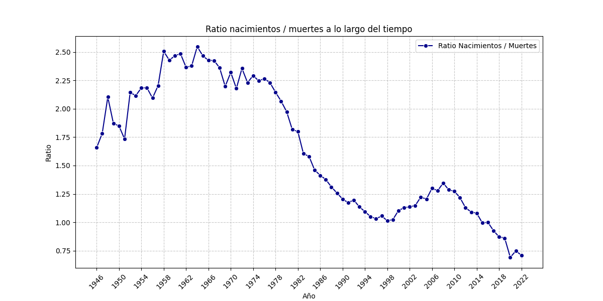

# Visualización de Datos - UOC - PEC 3

## Dataset

**INE**: [Movimiento Natural de la Población](https://www.ine.es/dynt3/inebase/index.htm?padre=1684&capsel=1684)

+ **CSV de Nacimientos**: [Fechas del 1941 al 2022](https://www.ine.es/jaxiT3/Tabla.htm?t=6518&L=0)
+ **CSV 1 de Defunciones**: [Fechas del 1930 al 1974](https://www.ine.es/jaxiT3/Tabla.htm?t=6553&L=0)
+ **CSV 2 de Defunciones**: [Fechas del 1975 al 2022](https://www.ine.es/jaxiT3/Tabla.htm?t=6545&L=0)

**Licencia**: Creative Commons Reconocimiento 4.0 (CC BY 4.0)

## Herramientras utilizadas

+ Jupyter Notebook
+ Python

## Descenso demografico en España

+ Código en [Notebook de Python](./CODE_UOC_VD_PEC3_Storytelling_ManuelErnestoMartinezMartin.ipynb)

### Evolución de natalidad y defunciones en España

### Evolución de natalidad en España (eventos importantes)

### Ratio de nacimientos y defunciones en España a lo largo del tiempo

### Cartograma de natalidad y defunciones por provincia

### Cartograma de natalidad y defunciones por comunidad

